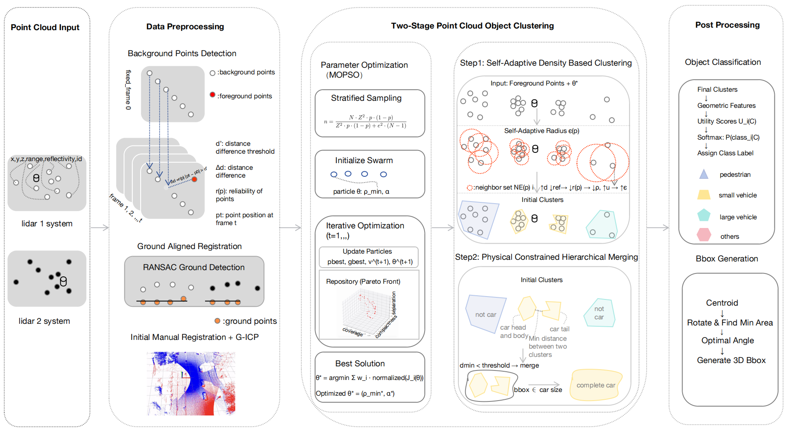
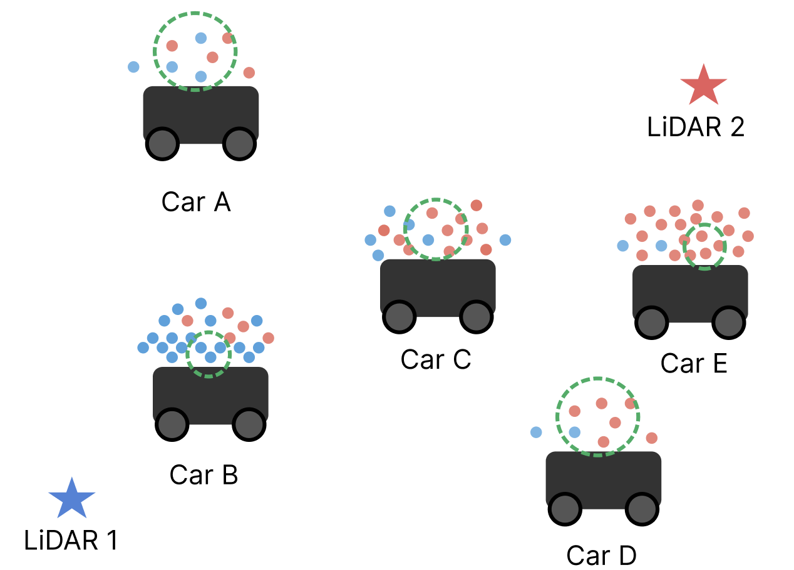
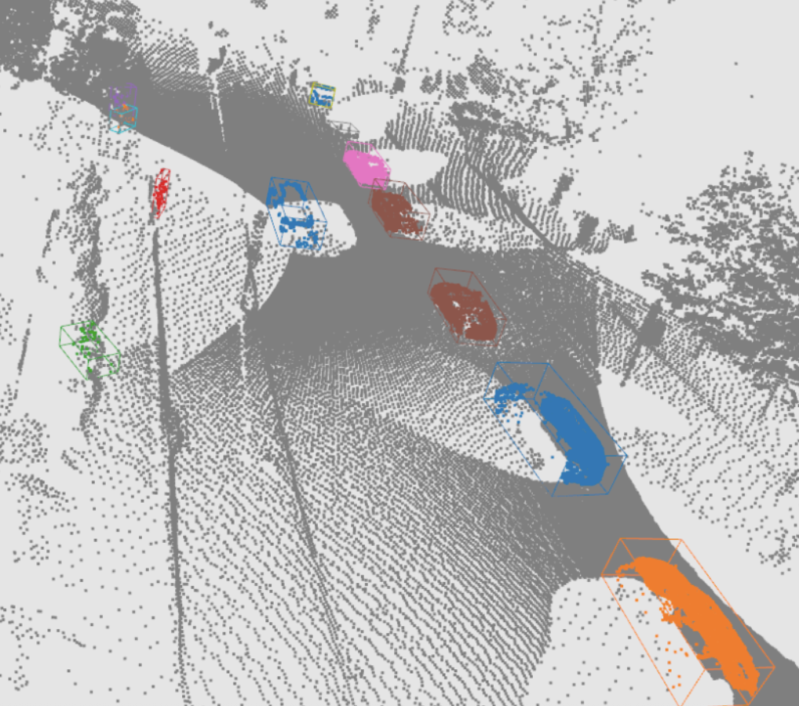

# MulDet3D

**Multi-Objective Optimization Based Unsupervised Object Detection for Multiple Roadside LiDARs**

[](https://doi.org/10.1061/JTEPBS.TEENG-9741)
[](LICENSE)

MulDet3D is an unsupervised, training-free framework for object detection in
roadside multi-LiDAR deployments. It combines reliability-weighted
background modeling, multi-sensor registration, a reliability-weighted
density-adaptive clustering algorithm, physically constrained hierarchical
merging, and a lightweight geometric classifier -- with clustering
hyperparameters automatically tuned per deployment via Multi-Objective
Particle Swarm Optimization (MOPSO). No labeled training data or GPU is
required.

<p align="center">
  
</p>

## Method

Four integrated components (see the paper for full derivations,
pseudocode, and the fixed-parameter tables):

1. **Preprocessing** -- reliability-weighted Gaussian background modeling
   (shared physics-based reliability metric with
   [FRGB3D](https://doi.org/10.1061/JCCEE5/CPENG-7710)) followed by
   ground-aligned multi-LiDAR registration (RANSAC ground-plane detection +
   manual initial alignment + Generalized ICP refinement).
2. **Two-stage clustering** -- Stage 1 is a reliability-weighted,
   density-adaptive clustering algorithm whose search radius shrinks in
   dense, well-observed regions; Stage 2 greedily merges nearby clusters
   under class/distance/volume/aspect-ratio constraints to correct
   over-segmentation.
3. **Feature-rich classification** -- hand-crafted geometric utility scores
   (volume, aspect ratio, height, density) converted to class probabilities
   via softmax, over 4 classes (pedestrian, small vehicle, large vehicle,
   other).
4. **Oriented 3D bounding box generation** -- minimum-area rotating
   calipers in the XY plane.
5. **Parameter optimization** -- MOPSO tunes the two clustering
   hyperparameters (adaptation rate `alpha`, minimum density `rho_min`)
   against three label-free proxy objectives (coverage, compactness,
   separation); a best-compromise solution is then selected from the
   resulting Pareto front.

<p align="center">
  
</p>

## Results

Evaluated on two real-world dual-LiDAR deployments, each with 1,000
manually annotated frames (Segments.ai; 3 annotators + adjudicator, mean
pairwise 3D IoU > 0.82):

| Dataset | Sensor layout | Small Vehicle AP@0.3 | Large Vehicle AP@0.5 | Pedestrian AP@0.1 |
|---|---|---|---|---|
| Lowell, MA (high density) | tilted dual Ouster OS1-128 | 70.23% | 72.08% (72.62% w/ Case 4) | 23.71% |
| Amherst, MA (moderate density) | horizontal dual Ouster OS1-128 | 71.72% | -- (no large vehicles in this dataset) | 76.71% |

Numbers above use the paper's "Case 3" MOPSO configuration (separation-optimized), the best-performing overall setting; see the paper for Cases 1-4 and their trade-offs. MulDet3D substantially outperforms DBSCAN (near 0% on both datasets), HDBSCAN, OPTICS, and adapted modern self-supervised detectors (CPD, OYSTER), which transfer poorly from autonomous-driving to roadside scenarios. An ablation study confirms both reliability-weighted background modeling and multi-LiDAR registration are necessary: removing background modeling drops small-vehicle AP@0.3 by 37-45 points; disabling registration (single sensor) drops it by 36-37 points.

<p align="center">
  
</p>

## Repository structure

```
MulDet3D/
├── src/
│   ├── detection/         # clustering.py (Stage 1/2 + DBSCAN/HDBSCAN baselines), classifying.py, compute_bbox.py -- the MulDet3D algorithm itself
│   ├── algorithms/        # mopso.py: Multi-Objective Particle Swarm Optimization
│   ├── preprocessing/     # background_model.py (reliability model, shared with FRGB3D), registration, ground-plane fitting, time alignment, PCAP conversion
│   └── utils/             # I/O and visualization helpers
├── scripts/
│   ├── run_preprocessing.py       # Dual-sensor background removal + fusion
│   ├── run_detection.py           # Two-stage clustering, classification, bbox generation
│   ├── evaluate_detection_ap.py   # Object-level AP@IoU evaluation
│   ├── optics_baseline.py         # OPTICS baseline (grid search + full-set run)
│   ├── optimize_stage_1.py        # MOPSO parameter search (alpha, rho_min)
│   ├── optimize_stage_2.py        # Best-compromise solution selection from the Pareto front
│   ├── iou_sensitivity.py         # AP under multiple uniform IoU thresholds
│   ├── significance_test.py       # Chunk-wise paired t-tests vs. baselines
│   ├── correlation_analysis.py    # Proxy-objective vs. AP correlation study
│   ├── preprocessing_ablation.py  # 2x2 ablation: background modeling x registration
│   └── data_preparation/          # PCAP -> bin, registration, time alignment, labeling prep
└── assets/                        # Figures used in this README
```

## Installation

```bash
git clone https://github.com/siyuanmengmax/MulDet3D.git
cd MulDet3D
pip install -r requirements.txt
```

PCAP conversion requires the [Ouster Python SDK](https://static.ouster.dev/sdk-docs/).

## Usage

```bash
# 1. Convert raw PCAP captures to per-frame .bin point clouds
python scripts/data_preparation/pcap_to_bin_one.py --pcap_file_path <sensor1.pcap> --json_file_path <sensor1.json>
python scripts/data_preparation/pcap_to_bin_two.py --pcap_file_path <sensor2.pcap> --json_file_path <sensor2.json>

# 2. Time-align the two sensors' frame sequences
python scripts/data_preparation/time_alignment.py

# 3. Register the two sensors into a common ground/coordinate frame
python scripts/data_preparation/registration.py

# 4. Build the background model and fuse the two sensors
python scripts/run_preprocessing.py

# 5. (Optional) Tune clustering parameters for your deployment via MOPSO
python scripts/optimize_stage_1.py --input_folder bin/merge_label
python scripts/optimize_stage_2.py --case case3

# 6. Cluster, classify, and fit bounding boxes
python scripts/run_detection.py --input_folder bin/merge_label --output_folder results/detection

# 7. Evaluate object-level AP against annotated ground truth
python scripts/evaluate_detection_ap.py \
    --groundtruth_json bin/lowell_1000_label.json \
    --detection_csv results/detection/bboxes.csv \
    --iou_threshold 0.3
```

To reproduce a baseline instead of MulDet3D, use `--clustering_method dbscan`
or `--clustering_method hdbscan` in `run_detection.py`, or run
`scripts/optics_baseline.py` for OPTICS. CPD and OYSTER results in the paper
were produced with the original authors' public implementations adapted to
roadside data, not reproduced in this repository -- see the paper for
citations.

`scripts/iou_sensitivity.py`, `scripts/significance_test.py`, and
`scripts/correlation_analysis.py` reproduce the paper's sensitivity,
significance, and proxy-objective-correlation analyses from a set of
per-method detection CSVs (see each script's `--help`).

> **Note on background-model parameters**: this preprocessing stage shares
> its formulas with [FRGB3D](https://github.com/siyuanmengmax/FRGB3D), but
> MulDet3D uses different fixed-parameter values (`tau_0 = 0.1 m`,
> `c_min = 10` frames vs. FRGB3D's `tau_0 = 1 m`, `c_min = 20`), matching
> this paper's own fixed-parameter table. The two repos' background-modeling
> code had drifted slightly during development; this repository's version
> was reconciled against the paper's stated formulas.

## Data

The full raw dataset (LiDAR PCAP captures) is too large for GitHub. The
curated benchmark used for all reported numbers -- 1,000 manually annotated
frames each for Lowell and Amherst, fused/registered and ready to run
through `run_detection.py` (~17.6 GB total) -- is available on Zenodo:

[](https://doi.org/10.5281/zenodo.22896184)
Lowell dataset (also used by [FRGB3D](https://github.com/siyuanmengmax/FRGB3D))

[](https://doi.org/10.5281/zenodo.22896192)
Amherst dataset

Each archive is split into several parts to accommodate upload limits; see
the dataset's own README for reassembly instructions. Full raw data is
available from the authors upon reasonable request.

## Citation

If you use this code or method, please cite:

```bibtex
@article{meng_muldet3d,
  title   = {{MulDet3D}: Multi-Objective Optimization Based Unsupervised Object Detection for Multiple Roadside {LiDAR}s},
  author  = {Meng, Siyuan and Zhang, Yanan and Raucci, David and Ai, Chengbo},
  journal = {Journal of Transportation Engineering, Part A: Systems},
  volume  = {152},
  number  = {10},
  pages   = {04026100},
  year    = {2026},
  publisher = {ASCE},
  doi     = {10.1061/JTEPBS.TEENG-9741},
}
```

If you use the benchmark datasets, please also cite:

```bibtex
@dataset{meng_lowell_benchmark,
  title   = {Lowell Dual-LiDAR Roadside Benchmark: 1,000 Annotated Frames},
  author  = {Meng, Siyuan and Parashar, Pravar and Yang, Yu-Min and Ai, Chengbo},
  year    = {2026},
  publisher = {Zenodo},
  doi     = {10.5281/zenodo.22896184},
}

@dataset{meng_amherst_benchmark,
  title   = {Amherst Dual-LiDAR Roadside Benchmark: 1,000 Annotated Frames},
  author  = {Meng, Siyuan and Zhang, Yanan and Raucci, David and Ai, Chengbo},
  year    = {2026},
  publisher = {Zenodo},
  doi     = {10.5281/zenodo.22896192},
}
```

## License

This project is licensed under the [MIT License](LICENSE).
